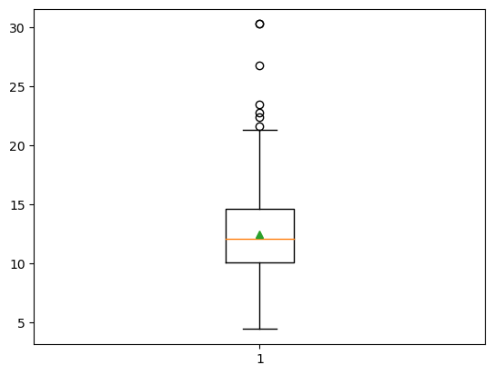
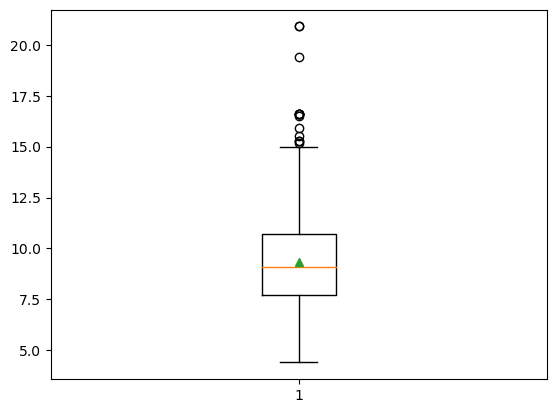

# Fuel Consumption Ratings 2023 - Data Preprocessing and Visualization - FIEK 2023/2024

## Overview
This project is developed as a part  of the Master studies curriculum at the Faculty of Electrical and Computer Engineering (FIEK). It focuses on the essential aspects of data preprocessing and visualization, key areas in the field of data science and analytics.

## Objective
The primary objective of this project is to demonstrate comprehensive skills in handling, processing, and visualizing data. It encompasses various techniques and methodologies pertinent to cleaning, transforming, and interpreting data effectively.

## Team Members
- Eriona Osaj
- Edon Budakova
  
## Introduction
This dataset contains model-specific fuel consumption ratings and estimated carbon dioxide emissions for new light-duty vehicles available for retail sale in Canada. The data has been adjusted to reflect 5-cycle testing, making it easier to compare vehicles from different model years. It includes information on various vehicle attributes and their environmental impact, which can be used to make informed decisions about fuel-efficient vehicles.

## Dataset Description
The dataset contains the following columns:
1. **Year:**
   - The model year of the vehicle, indicating when it was manufactured.

2. **Make:**
   - The brand or manufacturer of the vehicle.

3. **Model:**
   - The specific model name or designation of the vehicle.

4. **Vehicle Class:**
   - The category or type of the vehicle (e.g., sedan, SUV, truck) based on its intended use and design.

5. **Engine Size (L):**
   - The displacement of the vehicle's engine, measured in liters (L). the volume of fuel and air that can be pushed through a car's cylinders.
          
6. **Cylinders:**
   - The number of cylinders in the vehicle's engine. This is an important factor in determining the engine's power and efficiency.

7. **Transmission:**
   - The type of transmission system used in the vehicle, specifying how power is transmitted from the engine to the wheels.

8. **Fuel Type:**
   - The type of fuel that the vehicle uses (e.g., gasoline, diesel, electric).

9. **Fuel Consumption (L/100Km):**
   - The amount of fuel consumed by the vehicle per 100 kilometers traveled. It provides a measure of fuel efficiency.City       and highway fuel consumption ratings are shown in litres per 100 kilometres (L/100 km) - the combined rating (55% city,      45% hwy)
     
10. **Hwy (L/100 km):**
    - The highway fuel consumption rating, representing the vehicle's fuel efficiency on the highway.

11. **Comb (L/100 km):**
    - The combined fuel consumption rating, representing the vehicle's overall fuel efficiency in a mix of city and highway driving.

12. **Comb (mpg):**
    - The combined fuel consumption rating in miles per gallon (mpg). It provides an alternative measure of fuel efficiency.

13. **CO2 Emissions (g/km):**
    - The tailpipe emissions of carbon dioxide (in grams per kilometre) for combined city and highway driving. It indicates the environmental impact of the vehicle.

14. **CO2 Rating:**
    - The tailpipe emissions of carbon dioxide rated on a scale from 1 (worst) to 10 (best).

15. **Smog Rating:**
    - The tailpipe emissions of smog-forming pollutants rated on a scale from 1 (worst) to 10 (best).

## Data Preprocessing
In this Jupyter Notebook, we will perform the following data preprocessing steps:
1. Data Cleaning: We will check for and handle missing values and inconsistencies in the dataset.
2. Data Formatting: We will format columns to ensure consistency and ease of analysis.
3. Data Transformation: We may create new features or transform existing ones to better suit our analysis and visualization.

## Dataset Attributes

**Categorical Attributes:**

_Nominal:_
- Make
- Model
- Vehicle Class
- Transmission
- Fuel Type

_Ordinal:_
- CO2 Rating
- Smog Rating

**Numerical Attributes:**

_Interval:_
- Year

_Ratio:_
- Engine Size (L)
- Cylinders
- Fuel Consumption (L/100 km)
- Hwy (L/100 km)
- Comb (L/100 km)
- Comb (mpg)
- CO2 Emissions (g/km)

## Data quality
In our effort to ensure the highest data quality for our analysis, we conducted an extensive examination of the dataset. Below are our key findings and the methodologies applied in each aspect of data quality assessment.

### Noise and Unexpected Values

- **Noise in 'Year' Column**: Unusual non-year values were detected in the 'Year' column using `dataset['Year'].unique()`. Found entries include 'Understanding the table', 'Model', 'Transmission', 'Fuel type', 'Fuel consumption', 'CO2 emissions', 'CO2 rating', 'Smog rating'.
- **Noise in 'Make' Column**: We identified unexpected values in the 'Make' column with `dataset['Make'].unique()`. These include specific emissions information, fuel types, and transmission details such as 'the tailpipe emissions of carbon dioxide (in grams per kilometre) for combined city and highway driving', 'M = manual', '3 – 10 = Number of gears', 'X = regular gasoline', 'Z = premium gasoline', 'D = diesel', 'E = ethanol (E85)', 'N = natural gas'.

> **Note**: The exploration for outliers will be conducted in Phase 2 of our project.

### Missing Values

- **Detection and Strategy**: We detected missing values in various columns using `dataset.isnull().sum(axis=0)`. The findings are as follows:
  - Year: 15 missing values
  - Make: 2 missing values
  - Model: 23 missing values
  - Vehicle Class: 23 missing values
  - Engine Size (L): 23 missing values
  - Cylinders: 23 missing values
  - Transmission: 23 missing values
  - Fuel Type: 23 missing values
  - Fuel Consumption (L/100Km): 23 missing values
  - Hwy (L/100 km): 23 missing values
  - Comb (L/100 km): 23 missing values
  - Comb (mpg): 23 missing values
  - CO2 Emissions (g/km): 23 missing values
  - CO2 Rating: 23 missing values
  - Smog Rating: 23 missing values
  


### Duplicate Records
- **Duplicate Check**: We verified that there are no duplicate records in our dataset using the `dataset.duplicated().sum()` function, ensuring the uniqueness and integrity of our data.


## Data Integration
In our project, data integration plays a pivotal role in ensuring that we have a comprehensive and unified dataset for analysis. 

- **Single Source Integration**: Our dataset is sourced exclusively from Kaggle, which simplifies the integration process. The dataset encompasses extensive information about vehicle fuel consumption ratings and emissions, making it a valuable resource for our analysis. We imported the dataset into our analytical environment using the following command:

  ```python
  dataset = pd.read_csv('Data/fuel-consumption-ratings-2023.csv', encoding='ISO-8859-1')

## Aggregation
In our dataset, we've implemented several aggregation techniques to distill and comprehend the data more effectively. These aggregations help in summarizing the dataset and provide us with insights into CO2 emissions and fuel consumption patterns:

- **CO2 Emissions by Make**: We summarized the CO2 emissions data by the make of the vehicle. This aggregation allows us to observe which makes of vehicles tend to have higher or lower emissions on average.

- **CO2 Emissions by Fuel Type**: We analyzed the CO2 emissions according to the type of fuel used. This helps us understand the emission levels associated with different types of fuel, from gasoline to electric variants.

- **Fuel Consumption by Make**: We aggregated fuel consumption data by the vehicle's make, providing an average fuel consumption figure for each manufacturer. This is a crucial indicator of the efficiency and performance of different makes.

- **Fuel Consumption by Fuel Type**: The dataset was also aggregated to show fuel consumption based on fuel type. It helps in comparing the efficiency of vehicles running on different fuel sources.

The purpose of these aggregations is to:
- Simplify the dataset by reducing the number of attributes or objects, making the data more manageable.
- Adjust the scale of analysis from individual vehicles to broader categories such as make and fuel type.
- Achieve more stable and less variable data, which can be advantageous for identifying broader trends and making informed decisions.

Through these aggregated views, we gain a better understanding of the environmental impact and efficiency of vehicles, which is instrumental in driving forward our analysis and subsequent findings.

## Sampling
Sampling is a fundamental technique in data analysis, typically employed when dealing with large datasets. It enables statisticians and data analysts to perform preliminary investigations and derive conclusions without processing the entire dataset, which can be prohibitively expensive or time-consuming.

In the context of our project:

- Given our dataset comprises only 865 rows, full sampling is not essential for the preliminary or final analysis stages. The manageable size of our dataset allows us to conduct comprehensive examinations without the need to sample.
- This advantageously positions us to utilize the complete dataset, providing the benefit of drawing insights from every available data point and ensuring that our analysis encompasses all the nuances and patterns present.
- As such, we have opted to leverage the entire dataset for our analysis, ensuring that no detail, however minor, is overlooked in our pursuit of accuracy and depth in our findings.

We recognize the value of sampling in larger datasets and are prepared to implement this technique should the scope of our data expand in the future. For now, our focus remains on making the most of the detailed and rich dataset at our disposal.

## Data Cleaning
During our data cleaning process, we focused on enhancing the dataset's clarity and relevance by addressing entries with missing or irrelevant information.

- **Eliminating Irrelevant Entries**: Specific entries contained data that were irrelevant or did not make sense, such as erroneous entries in the 'Year' and 'Make' columns. We identified these entries as noise in our data.

- **Handling Rows with Null Values**: In instances where rows contained null values and coincided with the noisy data identified, we decided to remove these rows entirely from our dataset. This was done to ensure that our analysis would only be based on complete and accurate information.

Here is the approach we used to clean our dataset:
- We removed rows that had nonsensical values in 'Year' and 'Make' columns, which also contained null values across other attributes. This step was necessary to ensure the remaining data was free of noise and errors.
  


## Dimensionality Reduction
In the data preprocessing phase, we have also performed dimensionality reduction to simplify our model without losing important information.

### Redundant Feature Removal
Some features in our dataset were found to be redundant, providing no additional information.
- **Year Column Removal**: All entries in our dataset are from the year 2023; therefore, this feature does not provide any variance and has been dropped.

### Discretization and Binarization
To enhance model performance and interpretability, we categorized engine sizes into discrete bins:
- **Binning engine size into two categories**
  


### Transformation
We applied normalization to the CO2 emissions data to prepare for machine learning algorithms:

- **Normalize CO2 emissions data**:
  


## Phase 2: Outlier Detection and Data Exploration

In this phase, we focused on identifying and managing outliers, correcting inaccurate discoveries, and conducting a thorough exploration of the dataset, including summarizing statistics and multivariate analysis.

### Outlier and skewness etection using IQR (Boxplots)  

Outliers can significantly impact our analysis, leading to skewed results. Detecting and handling these is crucial for maintaining the integrity of our findings.

We used boxplots to visualize and detect outliers in our numerical data. Here's how we did it:

- `plt.boxplot(dataset['Engine Size (L)'], showmeans=True)`: This command generates a boxplot for the 'Engine Size (L)' column and shows the mean value. The boxplot provides a visual summary of the central tendency and dispersion of the data, as well as potential outliers.
  
  The following values were extracted from the 'Engine Size (L)' boxplot:
  - Median: The middle value of the dataset when it is ordered from least to most.
  - Mean: The average of the dataset, indicating central tendency.
  - Minimums: The lowest value within the range that is not considered an outlier.
  - Maximums: The highest value within the range that is not considered an outlier.

- `extract_boxplot_values(bp)`: This custom function extracts and prints the median, mean, minimum, and maximum values from the boxplot object. It uses the matplotlib `boxplot` object to access the statistical properties of the plotted data.

Here is an example of boxplot:


Any detected outliers were further investigated to determine whether they were the result of data entry errors or other inaccuracies. If an outlier was determined to be inaccurate, it was corrected if possible or removed to prevent it from distorting our analysis.

To understand the distribution of fuel consumption among the vehicles in our dataset, we visualized the 'Fuel Consumption (L/100Km)' using a boxplot and extracted key statistical values.

Generate a boxplot for the 'Fuel Consumption (L/100Km)' with the mean indicated
bp = plt.boxplot(dataset['Fuel Consumption (L/100Km)'], showmeans=True)


We used extract_boxplot_values(bp) to retrieve the median, mean, minimum, and maximum from the boxplot:

Median (12.1 L/100Km): Splits the dataset in half.
Mean (12.4315 L/100Km): Indicates the average, suggesting a right skew.
Minimum (4.4 L/100Km) and Maximum (21.3 L/100Km): Mark the range of typical values.

### Highway Fuel Consumption Analysis

To examine highway fuel efficiency, we plotted a boxplot for 'Hwy (L/100 km)' with the code:

```python
bp = plt.boxplot(dataset['Hwy (L/100 km)'], showmeans=True)
```

Median (5.0 L/100Km): The data's midpoint, with half of the vehicles being more efficient and the other half less so.
Mean (5.23649 L/100Km): Slightly higher than the median, indicating the small right skew.
Minimum (3.0 L/100Km) and Maximum (8.0 L/100Km): Represent the typical range of highway fuel consumption.


........
### Skewness

Skewness is a statistical metric that gives us an idea of the symmetry, or lack thereof, in the data distribution. The skewness coefficient is a single numerical value that reflects the shape of the distribution of values in a dataset.

Example: We calculate the skewness for the 'Cylinders' feature in our dataset as follows:
```python
skewness = dataset['Cylinders'].skew()
print(f"Skewness coefficient: {skewness}")
```
The skewness value gives us an indication of the asymmetry level in the distribution:

- **Approximately Symmetric Distribution**:
  - A skewness value between -0.5 and 0.5 means the distribution is approximately symmetric.

- **Moderately Skewed Distribution**:
  - A skewness value between -1 and -0.5 indicates moderate negative skewness (left-skewed).
  - A skewness value between 0.5 and 1 indicates moderate positive skewness (right-skewed).

- **Highly Skewed Distribution**:
  - A skewness value less than -1 indicates a highly negative skewness (left-skewed).
  - A skewness value greater than 1 indicates a highly positive skewness (right-skewed).


From boxplots and from function that displays skewness we can see that some of our data are skewed :
- **Engine Size (L)** - Right-skewed
  - Skewness coefficient: 1.0260918957977176
  - Interpretation: The majority of vehicles have smaller engines, with fewer vehicles having larger engines.

- **Cylinders** - Right-skewed
  - Skewness coefficient: 1.3003254083126115
  - Interpretation: Most vehicles have a lower number of cylinders, with fewer vehicles having a higher number of cylinders.

- **Fuel Consumption (L/100Km)** - Right-skewed
  - Skewness coefficient: 0.6917887375909869
  - Interpretation: Vehicles generally have lower fuel consumption, with fewer instances of high fuel consumption.

- **Hwy (L/100 km)** - Right-skewed
  - Skewness coefficient: 0.883049860122652
  - Interpretation: The distribution of highway fuel consumption is such that most vehicles are more fuel-efficient, with some exceptions having high consumption rates.

- **Comb (L/100 km)** - Right-skewed
  - Skewness coefficient: 0.7340232375008856
  - Interpretation: The combined fuel consumption metric also shows a right-skew, indicating a concentration of vehicles with lower consumption values.

- **CO2 Emissions (g/km)** - Slightly right-skewed
  - Skewness coefficient: 0.63581867933566
  - Interpretation: The CO2 emissions show a slight right-skew, implying a larger concentration of vehicles with emissions on the lower end.

- **CO2 Rating** - Slightly right-skewed
  - Skewness coefficient: 0.02460774858363436
  - Interpretation: This near-zero skewness suggests that the CO2 Rating is almost symmetrically distributed.

- **Smog Rating** - Left-skewed
  - Skewness coefficient: -0.8602475026142282
  - Interpretation: The Smog Rating distribution leans towards higher values, with a tail extending towards the lower end.

### Multivariate statistics

Correlation analysis is essential for understanding the relationships between different variables in a dataset. In our vehicle dataset, we explore how different metrics such as engine size, fuel consumption, and emissions ratings are interrelated. The following heatmap visualizes the correlation matrix, providing a color-coded representation of the correlation coefficients.

#### Insights from the Correlation Heatmap


*Figure: Heatmap of correlation coefficients between vehicle metrics.*

The heatmap allows us to quickly grasp the strength and direction of relationships:

- **Positive Correlations (Red tones)**: These indicate a direct relationship where an increase in one variable tends to be associated with an increase in another. For example, 'Cylinders' show a strong positive correlation with 'CO2 Emissions (g/km)', suggesting that vehicles with more cylinders tend to emit more CO2.

- **Negative Correlations (Blue tones)**: These signify an inverse relationship where an increase in one variable tends to be associated with a decrease in another. A notable example is between 'CO2 Rating' and 'Fuel Consumption (L/100km)', indicating that vehicles with a better CO2 rating typically consume less fuel.

- **Neutral Correlations (White tones)**: Near-zero values suggest no significant linear relationship between the variables.

##### Key Observations:

- 'Engine Size (L)' correlates strongly with 'Cylinders' and fuel consumption-related metrics, implying that larger engines are generally less fuel-efficient and produce higher emissions.

- 'CO2 Rating' has a notably strong negative correlation with fuel consumption and emissions metrics. This inverse relationship highlights that as fuel efficiency improves, CO2 ratings tend to be higher, denoting a lower environmental impact.

- 'Smog Rating' shows a moderate negative correlation with engine-related metrics, suggesting that higher engine sizes and fuel consumption could lead to lower smog ratings.

By understanding these correlations, we can better prepare our data for modeling and infer which features might be most significant in predicting vehicle emissions and efficiency.

### Visualization of Z-Score Outliers in Engine Size Distribution

In our data preprocessing steps, we've included an analysis of outliers within the 'Engine Size (L)' feature of our dataset. To identify these outliers, we've utilized the Z-score method. The following visualization aids in understanding the distribution of 'Engine Size (L)' and highlights the outliers detected through Z-scores.


*Figure: Engine Size (L) Distribution with Z-Score Outliers.*

#### Interpretation of the Visualization:

- **Data Points (Blue dots)**: Represent the engine sizes of individual vehicles within the dataset plotted against their index.

- **Mean (Red dashed line)**: Depicts the average engine size across the dataset.

- **Standard Deviation Regions**:
  - **Within 1 STD (Yellow shaded area)**: Encompasses 68% of the data points, indicating one standard deviation from the mean.
  - **Within 2 STD (Green shaded area)**: Covers 95% of the data points, indicating two standard deviations from the mean.
  - **Within 3 STD (Blue shaded area)**: Represents 99.7% of the data points, indicating three standard deviations from the mean.

- **Outliers (Red dots)**: These are the data points that lie beyond 3 standard deviations from the mean. These outliers are potential candidates for further scrutiny or removal to improve the robustness of subsequent analyses.

The function `plot_z_score_distribution_remove_outliers` is responsible for generating this plot and removing outliers. It calculates Z-scores for the specified property (`Engine Size (L)` in this case), marks the mean and standard deviation intervals, and highlights outliers. This visual representation is crucial in making informed decisions about outlier treatment, which is a key step in ensuring the quality of our dataset for modeling purposes.


### Outlier Removal

We have performed outlier detection based on the statistical analysis conducted earlier form the boxplots and from using z-score for rows that have too many outliers. Outliers were identified as values that fall outside the range defined by our boxplot analysis.

```python
# Determine the number of rows that have outlier values
number_of_rows = dataset[<various outlier conditions>].shape[0]

# Print the number of outliers detected
print(f"Number of outliers detected: {number_of_rows}")

# Calculate the total number of rows in the original dataset
print(f"Original dataset contained {dataset.shape[0]} rows.")

# Identify indices of outliers for removal
outliers_index = dataset[<various outlier conditions>].index

# Remove the outliers from the dataset
dataset.drop(outliers_index, inplace=True)

# Print the new number of rows after outliers have been removed
print(f"Dataset after dropping outliers contains {dataset.shape[0]} rows.")
```
### Outlier Removal Results

After applying our outlier detection criteria, we observed the following changes to our dataset:

- **Original Dataset Size**: 833 rows.
- **Dataset After Outlier Removal**: 818 rows.


## Phase 3 : Data Visualization
We will utilize various Python libraries for data visualization, including but not limited to:
- Matplotlib
- Seaborn
- Pandas
- Plotly
- Ipywidgets (interact)

Some of our visualization goals include:
- Exploring the distribution of fuel consumption across different vehicle classes.
- Analyzing the relationship between engine size, fuel consumption, and CO2 emissions.

### Vizualization according to datatypes

#### Countplots

A count plot is a type of bar chart that shows the frequency of items in different categories. In our project, we utilized a count plot to visualize the distribution of vehicles across various vehicle classes. This type of plot is particularly beneficial for categorical data where we want to compare the size of each category against others. We used countplots also for other categorical data but here we explain as example only for vehicle classes.

Key reasons for using a count plot in our analysis:

1. **Simplicity and Clarity**: Count plots provide a straightforward visual summary of the data, showing the count of observations in each categorical bin using bars.

2. **Comparison**: It allows for immediate comparison of the frequency between different categories. For instance, it can easily show which vehicle class is the most or least frequent in the dataset.

3. **Data Quality Checks**: It helps in identifying data imbalances or anomalies, such as a class with unusually high or low counts, which might indicate data collection biases or errors.

4. **Communication**: Count plots are widely recognized and understood, making them an excellent choice for communicating findings to a general audience.

##### Count of Vehicles by Vehicle Class

The count plot visualizes the distribution of vehicles across different classes, as extracted from the 2023 fuel consumption ratings dataset. The x-axis categorizes vehicles into full-size, SUVs (small, standard), compact, minicompact, two-seater, subcompact, station wagon (small, mid-size), pickup trucks (small, standard), minivan, and special purpose vehicles. The y-axis shows the number of vehicles in each category.

From the count plot, we can observe that standard SUVs and small station wagons have the highest count, indicating their popularity or prevalence in the dataset. On the other hand, special purpose vehicles and small pickup trucks are less common.

This visualization is particularly useful for identifying the most and least common vehicle types, which can inform market trends and potential focus areas for environmental efficiency improvements. It is created using a count plot, which is an excellent tool for displaying categorical data frequencies. The varying colors help in distinguishing between the different vehicle classes at a glance.


 Here is the code descripiton
 
 ```python
plt.figure(figsize=(10, 6)) # Set the size of the plot for better readability.
sns.countplot(x='Vehicle Class', data=dataset) # Create a count plot using seaborn library. The 'x' parameter specifies the column for which we want to show the counts.
plt.title('Count of Vehicles by Vehicle Class') # Add a title to the plot.
plt.xticks(rotation=45) # Rotate the x-axis labels by 45 degrees for better visibility of the labels.
plt.ylabel('Count') # Label the y-axis as 'Count'.
plt.xlabel('Vehicle Class') # Label the x-axis as 'Vehicle Class'.
plt.show() # Display the plot.

## Tools and Environment
We have used Jupyter Notebook for the analysis and visualization.
The analysis is performed using Python v3.11.5.
The required libraries (Pandas, Matplotlib, Seaborn) are included in the Anaconda distribution. 
```

## Additional Resources
- [Fuel Consumption Ratings Search Tool](https://www.nrcan.gc.ca/energy-efficiency/energy-efficiency-transportation/fuel-consumption-guide/21185)
- [More Information on Fuel Consumption Testing](https://www.nrcan.gc.ca/energy-efficiency/energy-efficiency-transportation/fuel-consumption-guide/21185)

## References
- [Original Dataset on Kaggle](https://www.kaggle.com/datasets/imtkaggleteam/fuel-concumption-ratings-2023)

We hope this Jupyter Notebook helps you explore and analyze the dataset effectively. Feel free to reach out to any of the team members for questions or further assistance.
